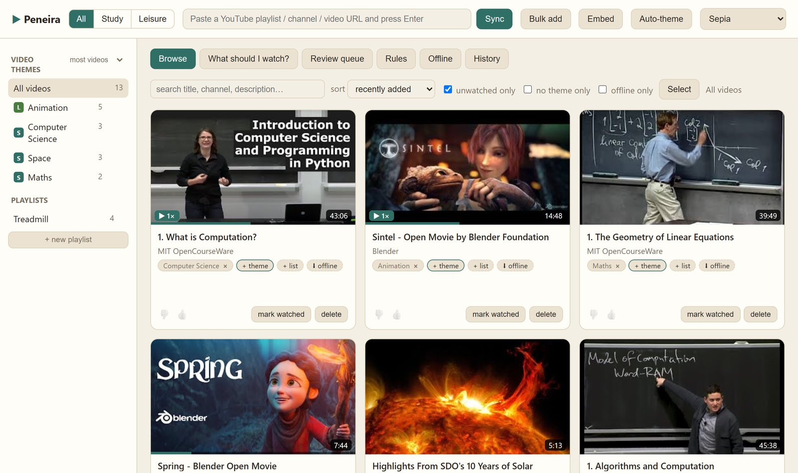
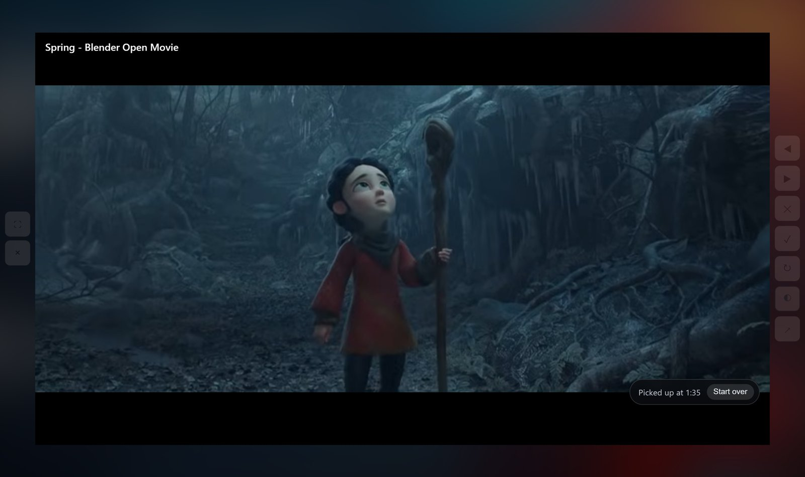
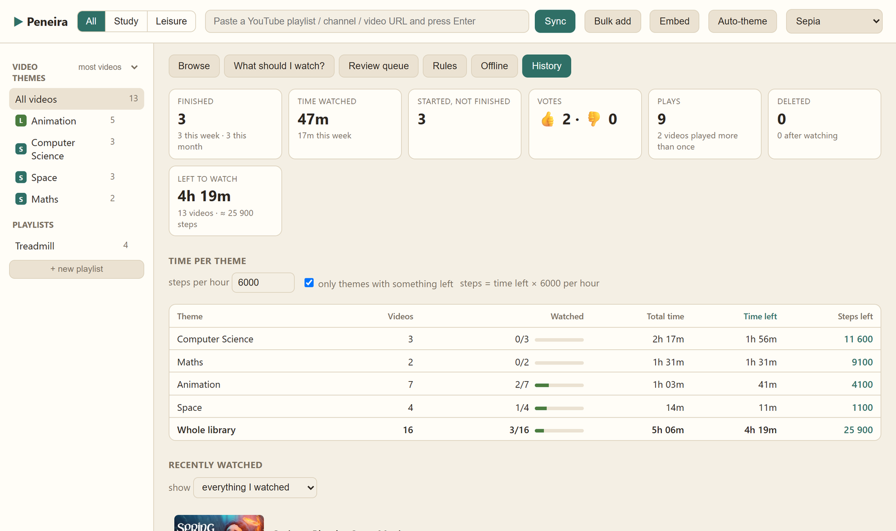

  

<h1 align="center">Peneira</h1>

  <b>Your YouTube Watch Later, curated.</b> 
  <i>O teu "ver mais tarde", escolhido a dedo.</i>

  

## What it does

- **Sync** playlists, channels and your Watch Later into one library on your computer
- **Themes** sorted automatically, and your corrections stick
- **Study / Leisure** switch, so work videos and fun ones never mix
- **Cinema mode**: the video fills the window, the controls wait at the sides
- **Drop and skip** what isn't worth your time, in one click
- **Time left** per theme, in hours and in treadmill steps

  
  

## Quick start (Windows)

1. Install [Python 3.11+](https://www.python.org/downloads/)
2. Double-click `start.bat`. The first run installs everything
3. Paste a playlist link and press **Sync**

For a Desktop icon, run `create-desktop-shortcut.bat` once.
On macOS or Linux: `pip install -e .` then `uvicorn app.main:app` and open
http://localhost:8000.

## Good to know

- Everything stays on your computer: one SQLite file, no account, no cloud.
- Offline copies are one video at a time, on purpose. There's no bulk download.
- Watch Later needs your browser's YouTube cookies. The guide explains how.

**[Read the full guide](docs/GUIDE.md)**: install, settings, offline copies,
troubleshooting and the API.

## License

Apache 2.0. See [LICENSE](LICENSE).
